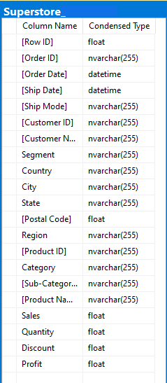
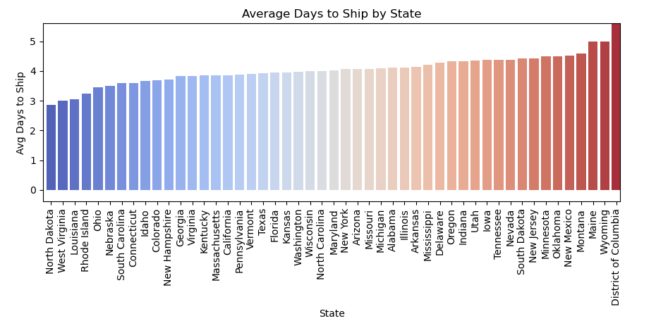
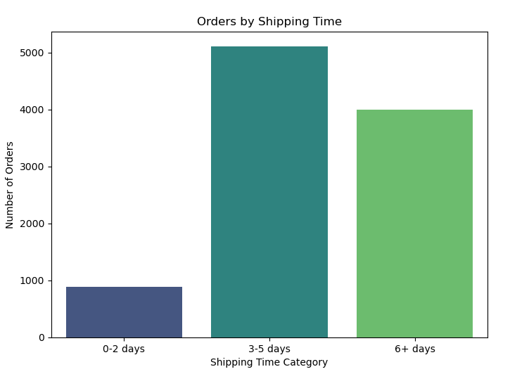
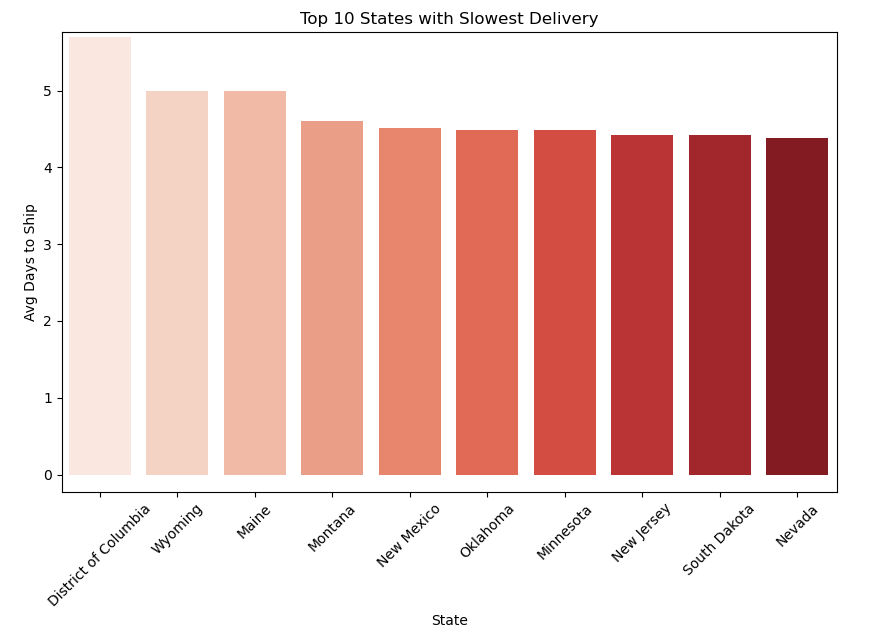
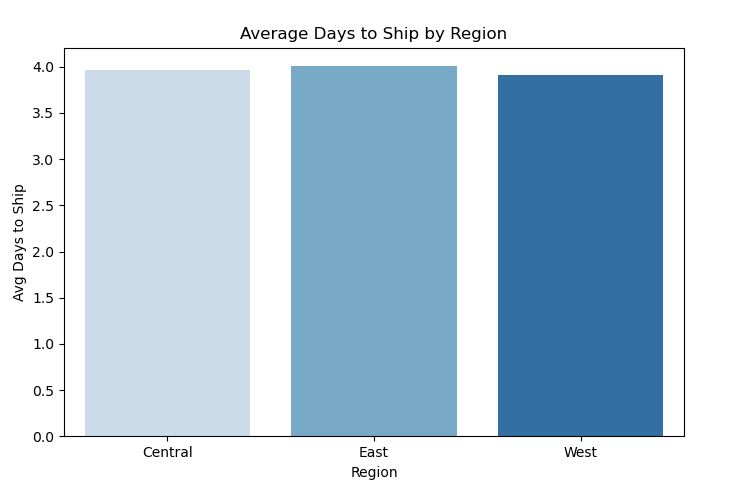
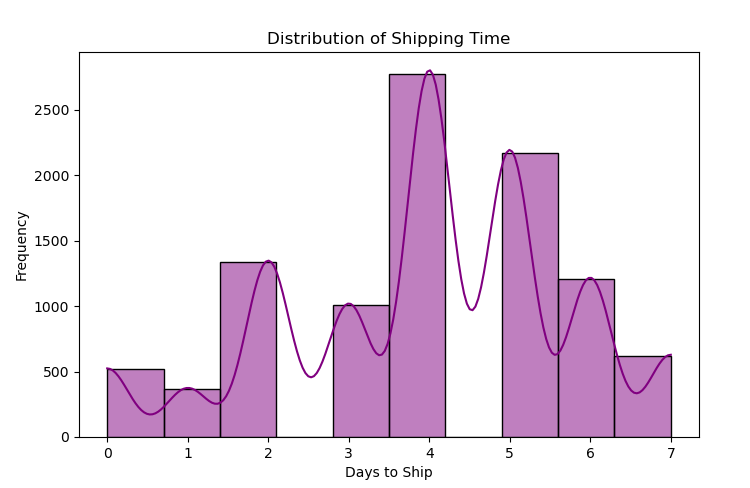

# Superstore Data Cleaning Project

## 📊 About the Superstore Dataset

The Superstore dataset is a collection of sales transactions. It includes detailed records about:

- **Orders**: Dates, quantities, and prices
- **Shipping**: Order and ship dates
- **Customer Information**: Locations and customer segments
- **Products**: Categories and product names
- **Geographic Data**: City, State, and Country

This dataset resembles the kind of sales and logistics data companies typically collect. It helps answer business questions such as:
- How long does it take to ship an order?
- Which products or regions perform best?
- What are customer purchasing patterns?

Python code used for the cleanup of the .csv file can be found here [link]().

---
# Data Structure
The companies main database structure as seen below consists of one table: Superstore, with a total row count of 9994 records. A description of each table is as follows:

---
## 🛠️ What This Script Does

This Python script prepares the Superstore data for deeper business analysis by performing several key cleanup tasks:

### 1. **Shipping Time Calculation**
- Adds a new column: **Days to Ship**
- This measures the number of days between when a customer places an order and when it is shipped.
- **Why?** Knowing how long it takes to ship orders is important for logistics and customer satisfaction analysis.

### 2. **State Abbreviation Conversion**
- Replaces full state names (like "California") with standard two-letter postal abbreviations (like "CA").
- **Why?** Abbreviations are consistent with most dashboards and mapping tools.

### 3. **Removing the Country Column**
- The dataset only includes U.S. data, so the country column is unnecessary and was removed.
- **Why?** Eliminating unnecessary data reduces clutter and improves performance in analysis tools.

### 4. **Fixing Product ID Conflicts**
- Some products with different names share the same **Product ID**, which should be unique.
- This script detects those duplicates and generates new IDs where needed (by increasing or decreasing the numeric part of the ID).
- **Why?** Ensures each product can be tracked separately in analysis and reporting tools.

---

## 🔁 Summary of Changes

- ✅ Added a **Days to Ship** column for logistics insights  
- ✅ Converted all U.S. state names to **abbreviated format**  
- ✅ Removed the **Country** column (all entries were "United States")  
- ✅ Identified and fixed **duplicate Product IDs**, ensuring each product has a unique identifier  

---

## 📈 How the Clean Data Can Be Used

The cleaned dataset is now more accurate, consistent, and ready for use in dashboards, reports, and business analysis. Here are a few ways this data can be leveraged:

### For Finance Executives:
- Analyze **shipping delays** and their impact on revenue.
- Evaluate **regional sales performance** using state-level breakdowns.
- Perform **product profitability analysis** using unique Product IDs.

### For Marketing Executives:
- Identify **high-performing product categories** or regions.
- Target customers by segment or region based on past buying behavior.
- Monitor **order-to-ship time** to align promotional campaigns with fulfillment capabilities.

---

## 📊 Sample Dashboard Overview

The cleaned Superstore data can power a set of dashboards to support strategic decision-making in both finance and marketing. Below are example dashboard ideas, including what they would display and the business questions they help answer.

---

### 🚚 Shipping Performance Dashboard
**Purpose**: Monitor delivery efficiency across regions.

**Key Metrics**:
- Average Days to Ship by State or Region
- Orders by Shipping Time (0–2 days, 3–5 days, 6+ days)
- Top 10 States with Slowest Delivery

**Business Questions Answered**:
- Are certain regions experiencing slower deliveries?
- Is our shipping process meeting expectations?
- Where should we focus logistics improvements?

Python code used for the visualization of the data can be found here [link]().
---

## ✅ Final Output

The cleaned data is saved as an Excel file:
